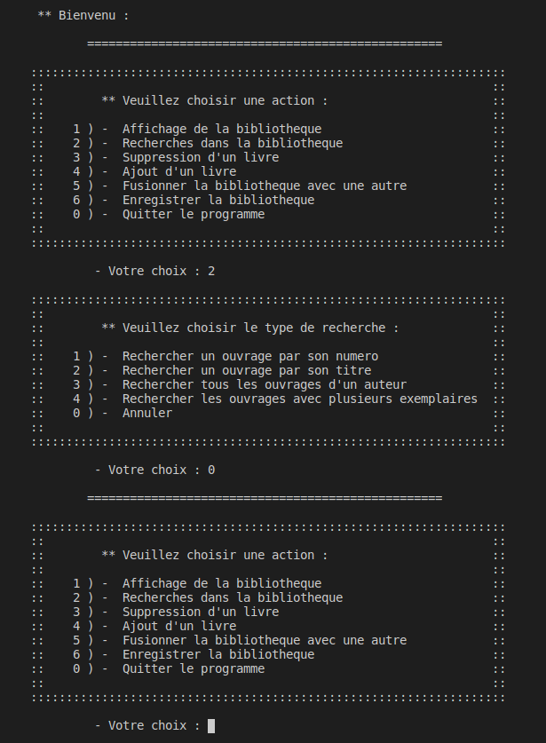
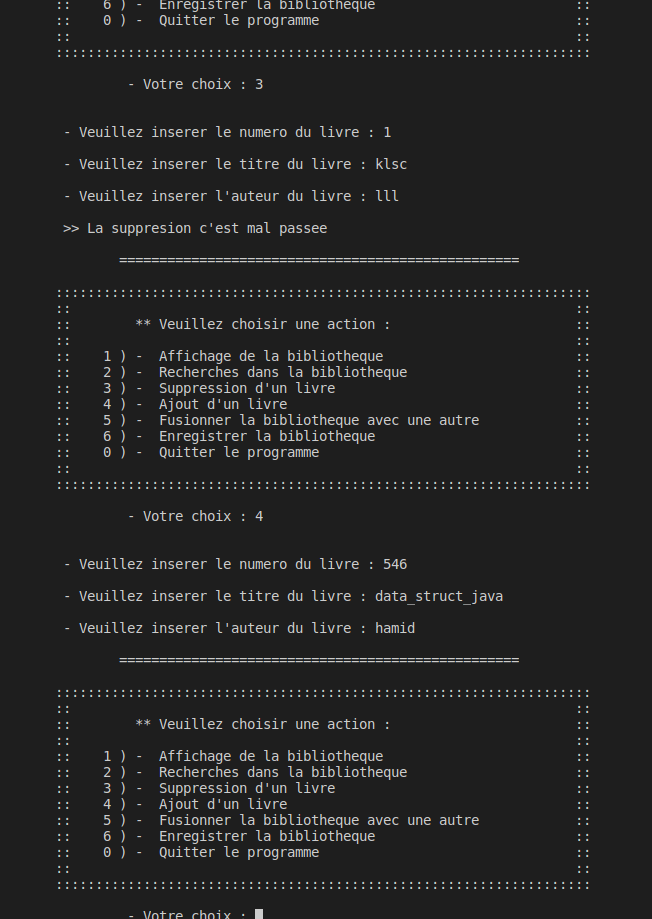
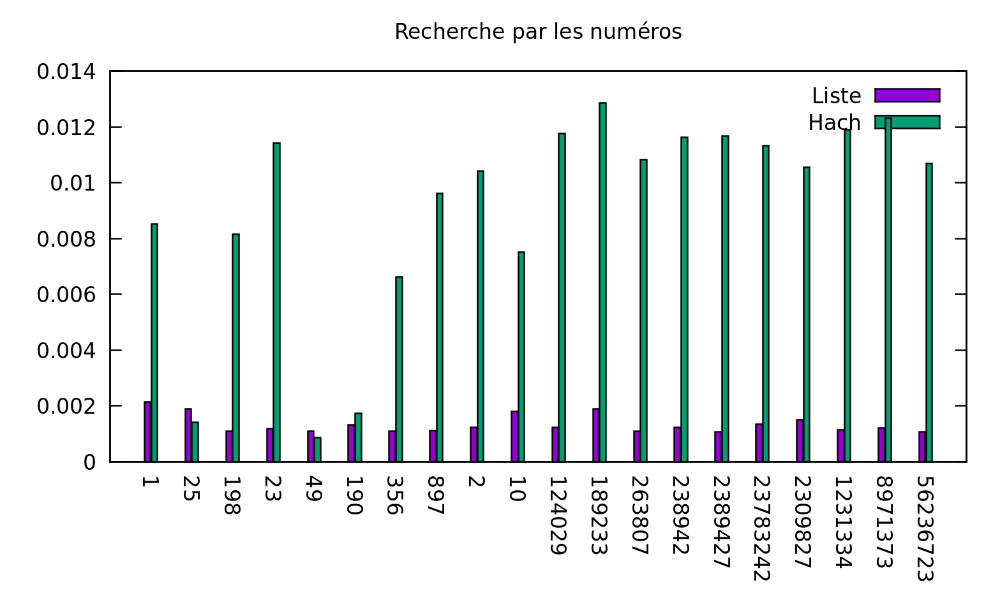
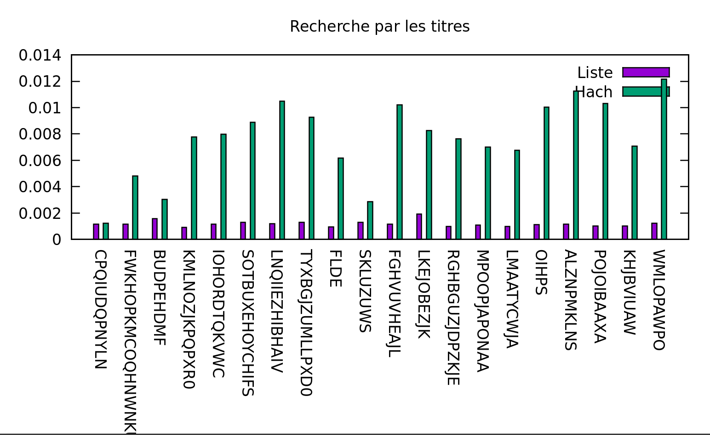
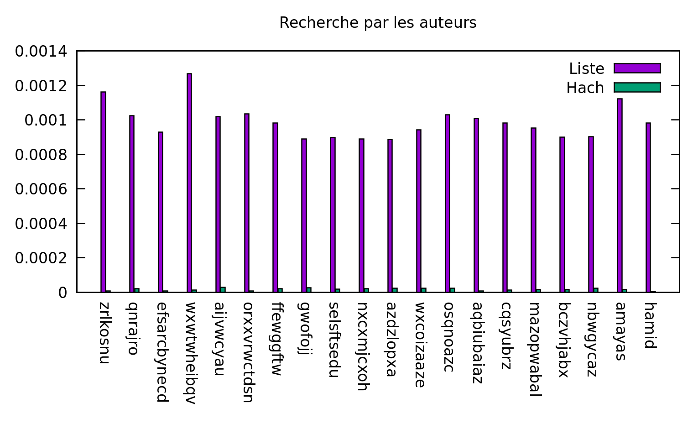
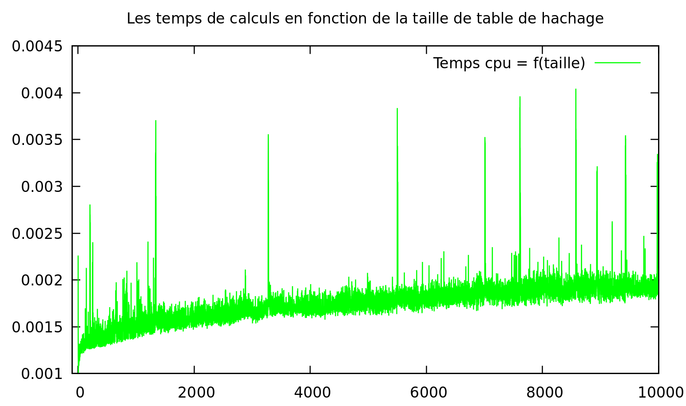
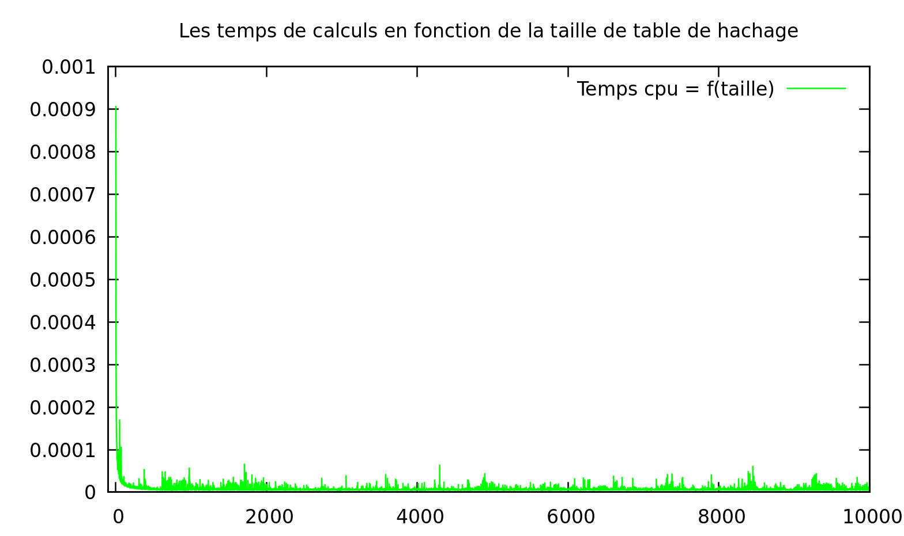
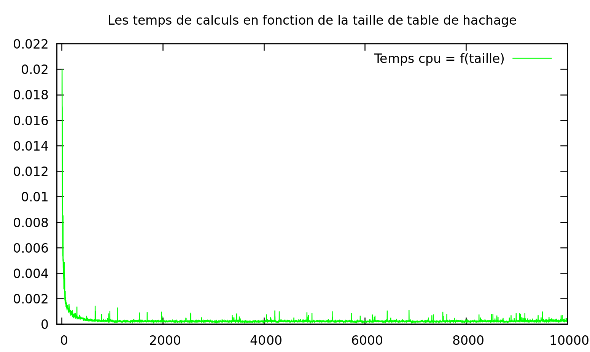
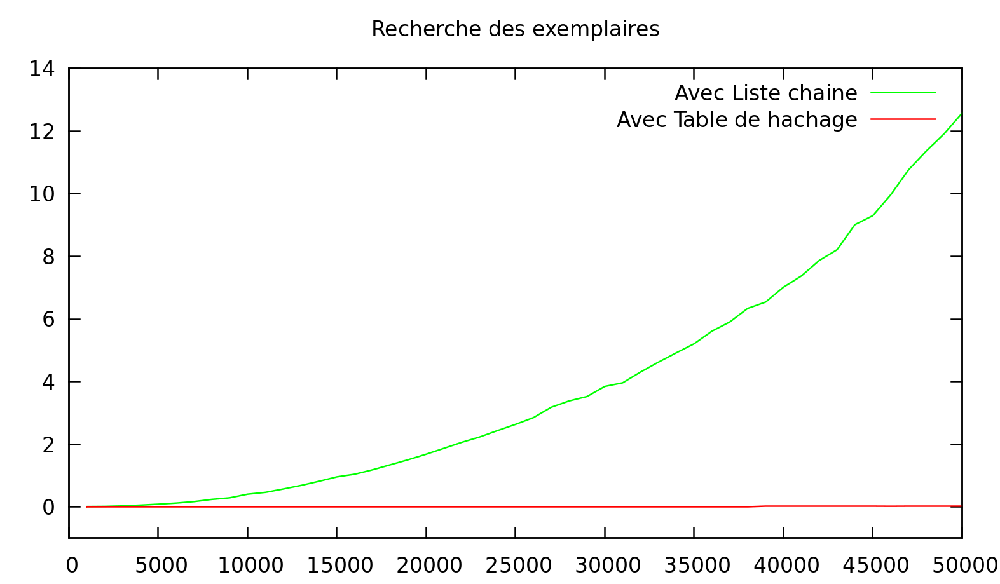
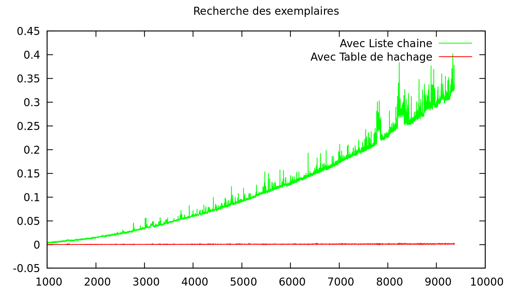

# Mini Projet 02 Structure de données

- **Membre du binome**

- Amayas Sadi 28717408
- Hamid Kolli 28717594

---

- *NB : On a modifier les noms des fonctions pour ne pas avoir des conflits lors des include des deux version (liste et table de hachage)*

*Les fonctions des listes sont suffixes pas `_lc` et celle des tables de hachages par `_h`*

## Exercice 01

### Q 1.1

- Voici les signatures des fonctions manipulant les listes de livres :

- Description des structures

 la structure livre `Livre` a pour but de gerer une liste de livres où chaque livre est representer par un numéro un titre et un auteur

 la structure bibliotheque `Biblio` est une liste de livres

```c

typedef struct livre {
    int num;
    char *titre;
    char *auteur;
    struct livre *suiv;
} Livre;

typedef struct {
    Livre *livres;
} Biblio;
```

- Les fonctions de base:

```c

//permet de cree et retourner un livre
Livre *creer_livre_lc(int num, char *titre, char *auteur);

//permet de liberer la memoire
void liberer_livre_lc(Livre *livre);

//permet de cree une bibliotheque
Biblio *creer_biblio_lc();

//permet de liberer une bibliotheque
void liberer_biblio_lc(Biblio *biblio);

//permet d'inserer un livre a la bibliotheque
void inserer_en_tete_lc(Biblio *biblio, int num, char *titre, char *auteur);

```

### Q 1.2

- Description des fonctions

> la plupart des fonctions ont un algorithme classique (affichage, inserstion, parcours ...)

### Q 1.3

- Description des fonctions

> Pour la fonction charger, elle permet de charger un nombre de livres donné dans une bibliotheque et pour ca on parcours le fichier jusqu'a la ligne `n` et on les insere dans la bibliotheque

> Pour la fonction enregister, elle permet d'ecrire toute la bibliotheque dans un fichier

```c
//permet de charger une bibliotheque de nombre de livres donnée en parametre a partir d'un fichier 
Biblio *charger_n_entrees_lc(char *nomfic, int nombre_lignes);

//permet de sauvgarder une bibliotheque dans un ficher
void enregister_biblio_lc(Biblio *biblio, char *nomfic);
```

### Q 1.4

```c
int main(int argc, char **argv) {
    if(argc != 3) {
        fprintf(stderr, "Manque d'arguments. \nUsage %s <nom fichier> <nombre lignes>\n", argv[0]);
        return 1;
    }
    //On ignore le nom de l'executable
    argc --;
    argv ++;
    
    //on cast le nombre de livres donné en entier 
    int lignes = atoi(argv[1]);

    Biblio *biblio = charger_n_entrees(argv[0], lignes);
    liberer_biblio(biblio);
    
    return 0;
}
```

### Q 1.5

- *NB : On a déviser les partie chaque partie dans un dossier, du coup chaque partie contient son propre Makefile*

- Makefile Partie_1

```bash

CFLAGS = -Wall -g
CC = gcc
PROGS = mainListe 

all : $(PROGS)

# --------------------------------------------

mainListe : biblioLC.o entreeSortieLC.o UIfonctions.o mainListe.o
    $(CC) $(CFLAGS) -o $@ $^

mainListe.o : mainListe.c entreeSortieLC.h ../commun.h
    $(CC) $(CFLAGS) -o $@ -c $<

biblioLC.o : biblioLC.c biblioLC.h ../commun.h
    $(CC) $(CFLAGS) -o $@ -c $<

entreeSortieLC.o : entreeSortieLC.c entreeSortieLC.h ../commun.h
    $(CC) $(CFLAGS) -o $@ -c $<

UIfonctions.o : UIfonctions.c UIfonctions.h entreeSortieLC.h biblioLC.h ../commun.h
    $(CC) $(CFLAGS) -o $@ -c $<

# --------------------------------------------

clean :
    rm -rf $(PROGS) *.o
```

### Q 1.6

- les fonctions de traitement

```c

//permet d'afficher un livre
void afficher_livre_lc(Livre *livre);

//permet dafficher tous les livres d'une bibliotheque
void afficher_biblio_lc(Biblio *biblio);

//permet de rechercher un livre dans une bibliotheque selon son nom
Livre *rechercher_biblio_numero_lc(Biblio *biblio, int numero);

//permet de rechercher un livre dans une bibliotheque selon son titre
Livre *rechercher_biblio_titre_lc(Biblio *biblio, char *titre);

//permet de rechercher tous les livres d'un auteur dans une bibliotheque
Biblio *rechercher_biblio_auteur_lc(Biblio *biblio, char *auteur);

//permet de supprimer un ouvrage dans une bibliotheque
int suppression_ouverage_lc(Biblio *biblio, int numero, char *titre, char *auteur);

//permet de fusionner deux bblioteque 
void fusion_biblios_lc(Biblio *src, Biblio *dest);

//permet de trouver tous les livres qui ont des exemplaire dans une bibliotheque
Biblio *rechercher_exemplaires_lc(Biblio *biblio);

```

- Description des fonctions:

> pour les fonctions de recherche on parcours toute la liste (pour le numero et le titre on returne le premier trouver, pour l'auteur on construit une liste de livres)

> pour la fusion on parcours la deuxieme bibliotheque et on insere tous ses livres qui n'existe dans la premiere bibliotheque (certes on fait un autre parcours sur la liste car on a pas supposer l'unicité des livres pour assurer la validité des données)

> On parcours la liste et à chaque fois on re-parcours pour trouver si le livre contient d'autres exemplaires si c'est le cas on le copie à une nouvelle liste qu'on retourne à la fin du traitement


### Q 1.7

Le main est un systeme d'interaction avec l'utilisateur, il posséde plusieurs menus et donne la possibilité à l'utilisateur de choisir l'option qu'il veut executer, donc l'utilisateur pourra intéragir comme il le souhaite avec les fonctions *(Un jeu de tests)*

- *1er Menu*



- *2eme Menu*



...

### 1.8

- Pour les fonctions d'affichage on a ajouter un fichier `UIfonctions.c` et son entête `UIfonctions.h`, le voici

```c

//permet d'afficher le menu pricipale
void menu();

//permet d'afficher le menu de recherche
void menu_recherche();

//permet d'afficher le menu pour choisir le flux de sortie pour l'enregistrement
void menu_output();

//permet de tester les message utilisateur pour les menu en s'assurant de la bonne saisie 
int get_choix(int min, int max);

//permet de recuperer un entier en affichant un message
int saisir_int(char *message);

//permet de gerer les recherche selon le leurs types
void rechercher(Biblio *biblio);

//permet de gerer la suppression dans une bibliotheque
void supprimer(Biblio *biblio);

//permet les gerer les ajouts des livres
void ajouter(Biblio *biblio);

//permet de gerer la fusion de deux bibliotheque (la deuxieme est donnée  sous forme d'un fichier en stdin)
void fusionner(Biblio *biblio);

//permet de sauvgarder la bibliotheque dans un fichier donner
void enregistrer(Biblio *biblio);

```

* Voici le main final de la partie 1

- C'est un menu qui fait appel au fonctions definie dans UIfonctions

```c
#include <stdlib.h>
#include <stdio.h>
#include <string.h>
#include "../commun.h"
#include "entreeSortieLC.h"
#include "UIfonctions.h"

int main(int argc, char **argv) {

    //on teste si le nombre d'argument donnée en parametre est bien 3
    if(argc != 3) {
        fprintf(stderr, "Manque d'arguments. \nUsage %s <nom fichier> <nombre lignes>\n", argv[0]);
        return 1;
    }

    //on ignore le nom du l'executable du tableau 
    argc --;
    argv ++;

    //on cast la chaine de caractere en entier
    int lignes = atoi(argv[1]);
    
    //on alloue la bibioteque 
    Biblio *biblio = charger_n_entrees_lc(argv[0], lignes);

    if(!biblio) {
        print_probleme("Pointeur non valide");
        return 1;
    }

    printf("\n\t ** Bienvenu : \n\n");

    int choix;

    while(1) {

        printf("\t\t==================================================\n\n");

        menu();
        choix = get_choix(0, 7);

        if(choix == 0)
            break;

        switch (choix) {
            case 1: {
                afficher_biblio_lc(biblio);
                printf("\n");
                break;
            }
            case 2: rechercher(biblio); break;

            case 3: supprimer(biblio); break;

            case 4: ajouter(biblio); break;

            case 5: fusionner(biblio); break;

            case 6: enregistrer(biblio); break;
        }
    }

    //on libere la bibliotheque
    liberer_biblio_lc(biblio);
    printf("\n\t ** Merci au revoir\n");
    return 0;
}
```

## Exercice 02

### Q 2.1

- Description des structures:

> La structure `LivreH` qui represente une liste de livres telle que un livre est definie comme la structure precedente avec une clef en plus

> la structure `BiblioH` qui represente une table de hachage des livres

```c
// La structure d'un livre
typedef struct livreh {
    int clef;
    int num;
    char *titre;
    char *auteur;
    struct livreh *suivant;
} LivreH;

// La table de hachage
typedef struct table {
    int nombresElems;
    int taille;
    LivreH **tab;
} BiblioH;
```

### Q 2.2

- La fonction clé qui retourne la somme des caracteres de l'auteur du livre

```c
// La fonction qui retourne la clé à partir de l'auteur
int fonction_clef(char *auteur);
```

```c
int fonction_clef(char *auteur) {
    
    int hach = 0;

    // On somme les code ascii des caracteres
    for(int i = 0; auteur[ i ]; i++)
        hach += auteur[ i ];
    
    return hach;
}
```

### Q 2.3
  
```c

// Créer un livre à partir de son numéro, titre et auteur
LivreH* creer_livre_h(int num, char *titre, char *auteur);

// Libere la mémoire alloué à un livre
void liberer_livre_h(LivreH *livre);

// Crée un bibliothéque à partir de sa taille
BiblioH *creer_biblio_h(int taille);

// Libere toute la mémoire alloué à la bibliotheque
void liberer_biblio_h(BiblioH *biblio);

```

- Description des fonctions:

> pour la creation d'une bibliotheque sous forme d'une table de hachage on alloue la structure elle meme le tableau et initialise toutes les case du tableau à NULL

> Pour la liberation on doit liberer toutes les cases (listes de livres) de la table et apres liberer la table et la structure

### Q 2.4

- Description des fonctions:

> c'est une fonction qui permet de retrouver l'indice d'un livre dans le tableau selon son auteur

```c
// La fonction de hachage
int fonction_hachage(int cle, int taille);
```

```c
int fonction_hachage(int cle, int taille) {

    float a = (sqrt(5) - 1) / 2;

    return (int) (taille * (cle * a - ( (int) (cle * a) )) );
}
```

### Q 2.5

```c
// Permet d'inserer un livre à une bibliotheque
void inserer_h(BiblioH *biblio, int num, char *titre, char *auteur);
```

- Desctiption de la fonction:

> À chaque insertion on cree un livre et on calcule la clef du livre et on l'insere dans la case qui lui corespond dans la table de hachage

### Q 2.6

```c
// Affiche un livres
void afficher_livre_h(LivreH *livre);

// Affiche la liste des livres
void afficher_livres_h(LivreH *livres);

// Libere la liste des livres
void liberer_livres_h(LivreH *livres);

// Affiche une bibliotheque
void afficher_biblio_h(BiblioH *biblio);

// Recherche un livre par son numero et le retourne si il existe
LivreH *rechercher_biblio_numero_h(BiblioH *biblio, int numero);

// Recherhce un livre par son titre et le retourne si il existe 
LivreH *rechercher_biblio_titre_h(BiblioH *biblio, char *titre);

// Recherhce tous les livres d'un auteur donné 
LivreH *rechercher_biblio_auteur_h(BiblioH *biblio, char *auteur);

// Supprime un livre de la bibliotheque et retourne le resultat de la requette 
int suppression_ouverage_h(BiblioH *biblio, int numero, char *titre, char *auteur);

// Permet de fussionner deux bibliotheques
void fusion_biblios_h(BiblioH *src, BiblioH *dest);

// Recherche tous les livres qui possédent plusieurs exemplaires dans la bibiotheque
LivreH *rechercher_exemplaires_h(BiblioH *biblio);

// Permet de savoir si un livre existe dans la bibiotheque
int existe_h(BiblioH *biblio, int numero, char *titre, char *auteur);
```

- Description des fonctions:

> Pour les fonction de la structure livreH et les fonctions d'affichages c'est le meme principe que la premiere partie

> Pour les fonction de recherche, la recherche par numero et titre on parcours toute la bbliotheque tandis que pour les auteurs on parcours que la liste du tableau qui correspond a la clef trouver par rapport au nom de l'auteur

## Exercice 03

### Q 3.1

- Explication de l'algorithme utiliser pour la comparaison:

> on a fixé le nombre de ligne a lire du fichier à 100000 et on varie selon les données à rechercher (quelques données sont dans les bibliotheque les autre non), pour ca on a utiliser des tableaux statiques

- __Selon les numeros__:

- Le graphe de recherche selon les numeros:



- Explication des resultat:

On remarque que la recherche selon le numero du livre en utilisant la liste est plus performante que la table de hachage parce que la fonction de hachage ne prend pas en compte le numero du livre mais son auteur donc pour rechercher un livre on doit parcourir toutes les case du tableau et pour chaque case on parcours sa liste de livres  donc on aura une complexite de O(n) (plus précisément O(m*alpha) ou m est la taille du tableau de la table et alpha est la moyenne de nombre d'elements dans une liste), par contre en utilisant la liste on parcours les elements un à un pour la recherche donc on aura un O(n) comme complexite, mais ce qui rend les listes plus performante que la table de hachage c'est que dans la table de hachage on accéde d'abord à les cases du tableau avant de parcourir la liste c'est un calcul en plus

-__Selon les titres__:

- Le graphe de recherche selon les titres:



- Explication des resultat:

On remarque que la recherche selon le titre du livre est un peu pres la meme chose que la recherche par numero vu qu'on doit parcourir toute la table de hachage et toute la liste des livres pour les deux bibliotheque
car la fonction de hachage depend que du nom d'auteur des livres

- __Selon les auteurs__:

- Le graphe de calcule selon les auteurs:



- Explication des resultat:

On remarque que la recherche selon l'auteur des livres est beaucoup plus puissante en utilisant la table de hachage car on accede directement a la position ou se trouve les livre de cet auteur sans parcourir le tableau, en calculant l'indice de cette case avec la fonction de hachage apres on cherche dans la liste associé à la case les livres ecrits par l'auteur recherché et ca donne une complexité de O(1) (plus precisement O(alpha) d'ou alpha est le nombre de livres présent dans la liste associé a la case), alors qu'on utilisant la liste on a un complexité de O(n) qui est largement moins bonne que O(1)

### Q 3.2

*NB : Pour les graphes on a déplacer un peu le 0 des abscisses pour avoir un affichage lisible)

- Description de l'algorithme
  
On a utiliser une boucle de 1 jusqu'a 10000 et on cree a chaque fois une table de taille de l'indice de la boucle, on effectue une recherche de livre par auteur pour voir la difference vu que la table de hachage est ranger selon l'auteur (la fonction de hachage dépend de l'auteur)

*Donc on a décider d'expoilter ce point pour les comparaisons, car la recherche avec les titres et avec le numéros on aura des résultats constants car c'est un parcours de toute la bibliotheque*

**On a tout de même effectue la recherche avec les titres pour illustrer notre explication**



>> On voit bien c'est presque constant, c'est pour ça qu'on a favorisé la recherche avec les auteurs, et voici les graphes obtenus

- Le graghe correspondant à la recherche selon l'auteur en lisant `10000` lignes du fichier :



- Le graghe correspondant à la recherche selon l'auteur en lisant `100000` lignes du fichier :




- Explication des resultats:

> On remarque que à chaque fois qu'on augmente la taille du tableau de la table de hachage le temps pris par le processeur deminue donc la complexité devient de plus en plus mieux car on aura moins de case a parcourir surtout apres les premieres iterations, apres la courbe devient de plus en plus constante

> Car au debut avec des valeurs petites pour la taille on aura des listes qui ont plusieurs élements donc la recherche tend vers du O(n) mais aprés on aura une bonne répartition dans les listes donc on aura moins à parcourir (la complexité va devenir du O(alpha) ce qui rend les résultats beaucoup plus meilleurs) 

### Q 3.3

- Explication de l'algorithme utilisé

On a utiliser une boucle de 1000 jusqu'a 50000 en ajoutant a chaque fois 1000 a l'indice ou on charge depuis le fichier des livres le nombre d'element correspond a l'indice de a boucle dans les deu bibliotheque et on fait une recherche des livres exemplaires et on calcule la complexité des deux recherches pour les mettre dans un fichier

*On incremente de 1000 à chaque fois, car avec incrémentation de 1 ça risque de prendre beaucoup de temps car nos fonction de recherches d'exemplaire sont quadratiques pour les liste en O(n²) pour la table de hachage en O(m * alpha²)*

- Le graphe obtenu avec une boucle de 1000 à 50000 avec un pas de 1000 



*Si on zoome un peu (donc avec un pas de 1 pour plus de précision on aura un résultat plus précis)*

- Le graphe obtenu avec une boucle de 1000 à 9000 avec un pas de 1 




## Q 3.4

- Explication des resultats : 

> On remarque que le temps de recherche d'exemplaire avec les liste est largement plus grand que celui avec la table de hachage ce qui s'explique avec les complexité, en effet la complexité de recherche avec les liste est en O(n²) car on fait un double parcours sur toute la liste tandis que c'est en O(m * alpha²) pour la table de hachage avec m c'est la taille du tableau et alpha c'est la moyenne des tailles des listes qui est constant donc la complexité devient que du O(m) qui est bien plus performant que du O(n²)

> Pour la recherche avec la table de hachage vu que on sait que tous les ouverages d'un auteur se trouvent dans une seule case du tableau donc il suffit que de parcourir la liste correspondante à l'indice obtenu donc moins d'élements à parcourir que dans les listes où on doit parcourir tous les livres